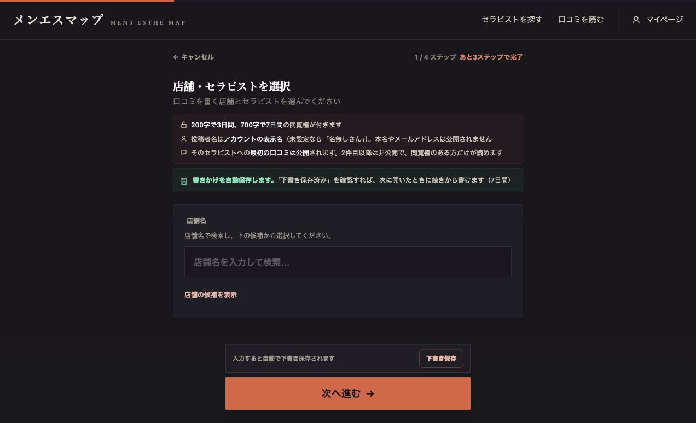
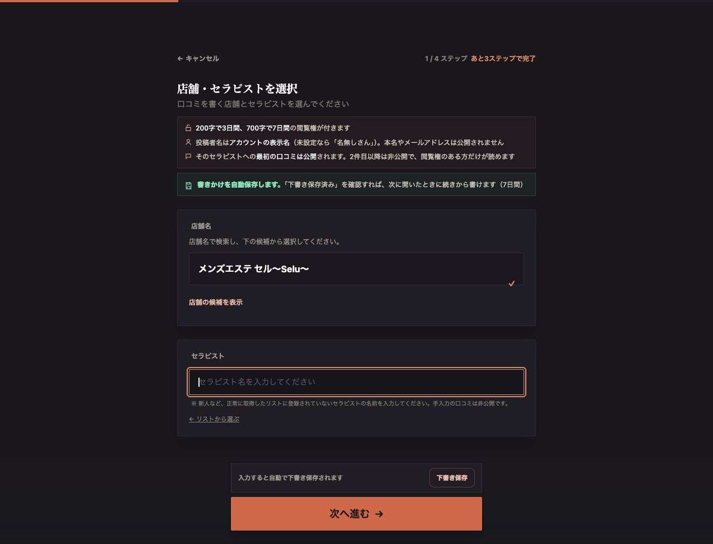

# C01：ブランド検索から未登録人物へ投稿するリンクの修正

確認日：2026-10-04（日本時間）。指示書は [RECHECK_AFTER_B_FIXES.md](../../docs/uiux-audit-2026-10-04/RECHECK_AFTER_B_FIXES.md)。

## 修正した動作

検索結果はブランド単位であるため、表示の「店舗1件」でも実店舗が複数ある。従来はブランドの `id` を `/post-review` の `shopId` に渡し、正しい投稿先の照合が不一致を検出していた。

`src/utils/unlistedReviewDestination.js` にリンク生成を集約し、`SearchPage.jsx` の実際の「リストにいない」カードへ適用した。

| 現在の検索対象 | 投稿リンク |
| --- | --- |
| 実店舗が1件で、店舗一覧でもそのIDを確認できた | その実店舗の `shopId` ＋ `customMode=true` |
| 複数ルーム、複数ブランド、未確認の店舗 | `/post-review?customMode=true`。店舗選択から開始 |
| 現在の検索で実店舗を明示指定済み | 実在・ブランド所属・正式名の一致を確認してそのIDを保持 |
| 検索入力が変更され、まだ前の検索結果が残っている | 前の店舗IDを渡さない |

IDは `shopIds` から取得し、重複を除去して扱う。未知のルームを除外して、残った1店舗へ自動振分けすることはない。URLは `URLSearchParams` で符号化する。検索URLの同期でも、正式な店舗名が現在の入力と一致する場合のみ明示指定の実店舗IDを維持する。

`PostReviewPage.jsx`、`reviewTarget.js`、投稿処理・下書き調停・送信前照合は変更していない。本番DB・スキーマ・権限設定も変更していない。

## 自動検証

- 新ガード `check_unlisted_review_destination.mjs` を共通のCI/prebuild一覧へ追加。
- 実際の `buildBrands` → 実SearchPageの可視リンク式 → 実PostReviewPage・フォーム・離脱保護の初期化をつなぎ、16条件を検査。
- 単独店舗、複数ルーム、複数ブランド、明示店舗、古いID、ブランドID、不正ID、未取得店舗、重複ID、URL符号化、入力と検索結果の時間差を確認。
- 店舗一覧が遅れて届く場合のURL同期、別投稿先の公開待ち下書き、新規入力の選択、既存下書きの再開を検査。本文と投稿先が本人の選択なしに混ざらず、検証中の公開処理は0回。
- メモリ上だけで9種類の妨害を実行。元のブランドIDリンク、代表ルーム自動指定、古いIDの引継ぎ、検索条件・所属・一意性・実在・URL符号化の検査除去をすべて検出した。
- 既存B04ガードには新helperの依存注入のみ追加し、従来の5種類の妨害検査を維持。
- 全29リリースガード、変更5ファイルのESLint、差分の空白検査が成功。

## 実画面確認

ローカルのTIGER GATE検索（1ブランド・89人物）から実リンクをクリックし、`/post-review?customMode=true` のステップ1・空の店舗検索欄へ到達。投稿先不一致の表示はなく、本文は入力していない。

`/search?shopId=tokyo_minato_toranomon_tiger_gate` では、店舗名の解決後も虎ノ門の実店舗IDを検索URL・投稿リンクに保持した。別の検索語へ変更すると古いIDが外れた。単独ブランドの `Selu` 検索では、リンクが `shopId=tokyo_shibuya_yoyogiuehara_selu` になった。

Git archiveで作成した独立ソースでもNode 22.23.3の全29ガード・29ページbuildが成功。本番形式のローカル実画面からSeluのリンクをクリックし、正式店舗名の選択済み表示と手入力の人物名欄まで確認した。

### 本番反映と反映後の確認

- 修正コミット：`4071cd7ab45b85fa8921add728189eb570a6f47b`。
- GitHub [CI #321 / run 37168569752](https://github.com/tugihe1112-cell/mens-esthe-site-v3/actions/runs/37168569752)：全ステップ成功。
- Vercel Production：`dpl_8m4hP7bptSSX3BXb8EaCMvLUR8CT`、Ready。www・wwwなしの両本番aliasを確認。
- buildId：`1vOLb1eYUmQiacBLpkLkp`。
- 先に本番の確認用タブで、下書き選択が出ずステップ1の店舗欄が空であることを確認した。既存の本人タブや保存領域の操作はしていない。
- 反映後の本番検索欄へ `TIGER GATE` を入力し、実際の「リストにいない」リンクが `/post-review?customMode=true` であることを確認してクリック。店舗選択のステップ1に到達し、投稿先不一致は出なかった。
- 同じ本番画面の `Selu` 検索では、実店舗 `tokyo_shibuya_yoyogiuehara_selu` を渡す実リンクから、正式店舗名の選択済み表示と人物名入力へ到達した。
- 両方の確認で本文入力・下書き保存ボタン・送信は操作していない。投稿画面のコンソールエラーは0件。
- 本番主要5ページ・16固有チャンク、公開API・認証拒否・メソッド制限・セキュリティヘッダーの検査が成功。
- 本番ホームも同じbuildIdで公開口コミ35件・最新7件・地域5区分、取得失敗フラグfalse、1,147店舗・57,648人を確認した。

開発モードの実店舗指定では、既存のStrictMode疑似cleanupと初期化の世代管理により「確認中」が残る経路を観察した。今回のリンク生成変更とは別の開発時の経路であり、投稿ページは変更していない。本番形式ビルドと本番では上記の実店舗選択が成功している。

## 残る調査事項

指示書D01の過去の掲載件数API一時503は今回のリンク修正とは別の原因調査事項。今回の修正で解消したとは扱わない。
